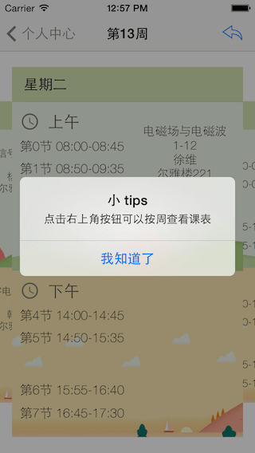
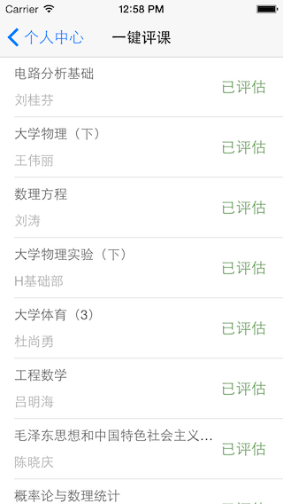
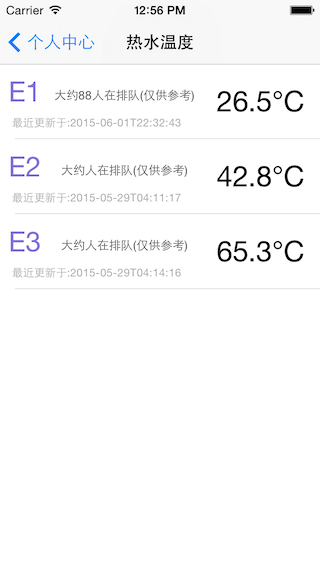

Liaoning Technical University(LNTU) Education Administration Management System App for iOS.
---

## Licence

协议用中文写在前面，希望大家明白我意思。

采用了 General Public License version 2 ([GPLv2](http://www.gnu.org/licenses/old-licenses/gpl-2.0.html)).

附加协议：

- 不管用于什么用途，必须遵守 GPLv2 协议
- 禁止以任何形式参加任何比赛，毕业设计

```
Copyright (C) 2015-2016 LNTU.ORG (https://lntu.org)
Copyright (C) 2013-2015 PUPBOSS <hi@pupboss.com>

This program is free software; you can redistribute it and/or
modify it under the terms of the GNU General Public License
as published by the Free Software Foundation; either version 2
of the License, or (at your option) any later version.

This program is distributed in the hope that it will be useful,
but WITHOUT ANY WARRANTY; without even the implied warranty of
MERCHANTABILITY or FITNESS FOR A PARTICULAR PURPOSE.  See the
GNU General Public License for more details.

You should have received a copy of the GNU General Public License
along with this program; if not, write to the Free Software
Foundation, Inc., 51 Franklin Street, Fifth Floor, Boston, MA  02110-1301, USA.
```

## Requirements

- iOS 7.0+
- Xcode 6

## Feature

- Query self information
- Query school report
- One click rating
- Query heater temprature

## Contact

- [hi@pupboss.com](mailto:hi@pupboss.com)
- [PUPBOSS.COM](https://pupboss.com)

## Screenshot

 

 